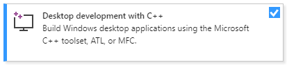
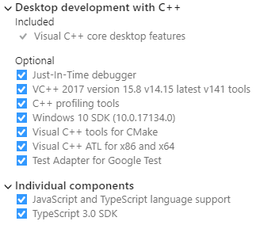

# Development
Installation and configuration of a Windows 10 development workstation.


## Tools
Install various tools useful for Windows development.

* [Perl 5](http://strawberryperl.com/)
* [Python 3](https://www.python.org/)
* [Java SE Development Kit (JDK) 8](http://www.oracle.com/technetwork/java/javase/downloads/index.html)
* [CMake](https://cmake.org)
* [NASM](http://www.nasm.us)
* [HxD](https://mh-nexus.de/en/hxd)
* [CFF Explorer](http://www.ntcore.com/exsuite.php)
* [Resource Hacker](http://www.angusj.com/resourcehacker)
* [Sysinternals Suite](https://technet.microsoft.com/en-us/sysinternals/bb842062.aspx)
* [Clang Format](https://llvm.org/builds/)

<!--
Backup locations.

```
C:\Program Files\ConEmu
C:\Program Files\HxD
C:\Program Files\NASM
C:\Program Files\WSL
C:\Program Files (x86)\Resource Hacker
C:\Program Files (x86)\Sysinternals Suite
```
-->


## Visual Studio 2017
Install and configure [Visual Studio 2017 Community](https://visualstudio.microsoft.com/downloads/).<br/>





### Configuration
```
Tools > Options
Environment
+ General
  Color theme: Dark
+ Documents
  [✓] Detect when file is changed outside the environment
      [✓] Reload modified files unless there are unsaved changes
  [✓] Save documents as Unicode when data cannot be saved in codepage
+ Fonts and Colors
  Text Editor: DejaVu LGC Sans Mono 9
  Printer and Cut/Copy: Iconsolata 10
  [All Text Tool Windows]: DejaVu LGC Sans Mono 9
+ Quick Launch
  [ ] Enable Quick Launch
+ Startup
  At startup: Show empty environment
  [ ] Download content every: 60 minutes
Projects and Solutions
+ General
  [ ] Always show Error list if build finishes with errors
  [ ] Warn user when the project location is not trusted
+ Build and Run
  On Run, when projects are out of date: Always build
  On Run, when build or deployment error occur: Do not launch
Source Control
+ Plug-in Selection
  Current source control plug-in: Git
Text Editor
+ General
  [ ] Enable mouse click to perform Go to Definition
  [ ] Highlight current line
  [ ] Show structure guide lines
+ All Languages
  + General
    [✓] Line numbers
    [ ] Apply Cut or Copy to blank lines when there is no selection
  + Scroll Bars
    (•) Use map mode for vertical scroll bar
        [ ] Show Preview Tooltip
        Source overview: Wide
  + Tabs
    Indenting: Smart
    Tab size: 2
    Indent size: 2
    (•) Indent spaces
+ C/C++
  + Formatting
    + General
      (•) Run ClangFormat only for manually invoked formatting commands
      [✓] Use custom clang-format.exe file: (Latest version from <https://llvm.org/builds/>.)
    + Indentation
      [ ] Indent namespace contents
    + New Lines
      Position of open braces for namespaces: Keep on the same line, but add a space before
      Position of open braces for types: Keep on the same line, but add a space before
      Position of open braces for functions: Move to a new line
      Position of open braces for control blocks: Keep on the same line, but add a space before
      Position of open braces for lambdas: Keep on the same line, but add a space before
      [✓] Place braces on separate lines
      [✓] For empty types, move closing braces to the same line as opening braces
      [✓] For empty function bodies, move closing braces to the same line as opening braces
      [ ] Place 'else' on a new line
      [✓] Place 'catch' and similar keywords on a new line
      [ ] Place 'while' in a do-while loop on a new line
    + Wrapping
      (•) Always apply New Lines settings for blocks
  + View
    + Outlining
      Enable Outlining: False
+ CSS
  + Advanced
    Color picker format: #000
    Automatic formatting: Off
+ JavaScript/TrueScript
  + Formatting
    + General
      [ ] Format completed line on Enter
      [ ] Format completed statement on ;
      [ ] Format opened block on {
      [ ] Format completed block on }
    + Spacing
      [ ] Insert space after function keyword for anonymous functions
+ JSON
  + Advanced
    Automatic formatting: Off
```


### Plugins
Install [Trailing Whitespace Visualizer](https://marketplace.visualstudio.com/items?itemName=MadsKristensen.TrailingWhitespaceVisualizer).

Install and configure [Line Endings Unifier](https://marketplace.visualstudio.com/items?itemName=JakubBielawa.LineEndingsUnifier).

```
Tools > Options
Line Endings Unifier
+ General Settings
  Add Newline On The Last Line: True
  Default Line Ending: Linux
  Force Default Line Ending On Document Save: True
  Save Files After Unifying: True
  Supported File Formats: .c; .cc; .cpp; .h; .hh; .hpp; .in; .js; .json; .html; .md; .sh; .conf; .txt
  Supported File Names: makefile
```

Install [NPL_LuaLanguageService](https://marketplace.visualstudio.com/items?itemName=Xizhi.NPLLuaLanguageService).

```
Tools > Options > Environment > Fonts and Colors
+ Display items: NPL.NPLFunction
  Item foreground: R:0 G:215 B:0
  [ ] bold
+ Display items: NPL.NPLSelf
  Item foreground: R:0 G:204 B:204
  [ ] bold
```


## Windows Driver Kit
Install [WDK for Windows 10](https://docs.microsoft.com/en-us/windows-hardware/drivers/debugger/).


## Environment Variables
Configure the `Path` environment variable.

```
%SystemRoot%\system32
%SystemRoot%
%SystemRoot%\System32\Wbem
%SystemRoot%\System32\WindowsPowerShell\v1.0
%SystemRoot%\System32\OpenSSH
%ProgramFiles(x86)%\Microsoft Visual Studio\2017\Community\Common7\IDE
%ProgramFiles(x86)%\Sysinternals Suite
%ProgramFiles%\Java\jdk1.8.{version}\bin
%ProgramFiles%\Git\cmd
%ProgramFiles%\NASM
C:\Android\platform-tools
C:\Android\tools\bin
C:\Android\tools
C:\Perl\c\bin
C:\Perl\perl\site\bin
C:\Perl\perl\bin
C:\Python\Scripts
C:\Python
C:\Workspace\vcpkg
```


## Android
Extract the [Android SDK Tools](https://developer.android.com/studio/#downloads) to `C:\Android\tools`.

Install Android SDK, NDK, USB driver and `adb`.

```cmd
android update sdk
sdkmanager "platform-tools"
sdkmanager "platforms;android-28"
sdkmanager "extras;google;usb_driver"
sdkmanager "build-tools;28.0.2"
sdkmanager "ndk-bundle"
```

Verify that `adb` works.

```cmd
adb devices
adb shell pm list users
```


Install [Qt](https://www.qt.io/download).

```
Qt
[■] Qt 5.11.1
  [✓] MSVC 2017 64-bit
  [✓] Android ARMv7
  [✓] Qt Charts
  [✓] Qt Data Visualization
  [✓] Qt Virtual Keyboard
  [✓] Qt WebEngine
[■] Tools
  Qt Creator 4.7.0
  [✓] Qt Creator 4.7.0 CDB Debugger Support
  [✓] Qt 3D Studio 2.0.0
  [✓] Qt 3D Studio Runtime 2.0.0
  [✓] Qt Installer Framework 3.0
```

Configure Qt Creator.

```
Tools > Options > Devices
Android SDK location: C:\Android
Android NDK location: C:\Android\ndk-bundle
Apply
[ ] Automatically create kits for Android tool chains
```


## Vcpkg
Configure the `VCPKG_DEFAULT_TRIPLET` environment variable.

```
x64-windows-static
```

Install Vcpkg.

```cmd
git clone https://github.com/Microsoft/vcpkg C:\Workspace\vcpkg
cd C:\Workspace\vcpkg && bootstrap-vcpkg.bat && vcpkg integrate install
cd %UserProfile% && rd /q /s ^
  "C:\Workspace\vcpkg\toolsrc\Release" ^
  "C:\Workspace\vcpkg\toolsrc\vcpkg\Release" ^
  "C:\Workspace\vcpkg\toolsrc\vcpkglib\Release" ^
  "C:\Workspace\vcpkg\toolsrc\vcpkgmetricsuploader\Release"
```

Install Vcpkg packages.

```cmd
vcpkg install bzip2 date fmt libjpeg-turbo liblzma libpng libssh2 nlohmann-json openssl wtl zlib
vcpkg install benchmark gtest
```


## Windows Subsystem for Linux
Take ownership of `/opt`.

```sh
USER=`id -un` GROUP=`id -gn` sudo chown $USER:$GROUP /opt
```

Install development packages.

```sh
sudo apt install build-essential binutils-dev gdb libedit-dev nasm python python-pip git subversion swig
```

Install CMake and Ninja.

```sh
rm -rf /opt/cmake; mkdir /opt/cmake
wget https://cmake.org/files/v3.12/cmake-3.12.2-Linux-x86_64.tar.gz
tar xvf cmake-3.12.2-Linux-x86_64.tar.gz -C /opt/cmake --strip-components 1
git clone -b release https://github.com/ninja-build/ninja
cd ninja && ./configure.py --bootstrap && cp ninja /opt/cmake/bin/
```

Install NodeJS.

```sh
rm -rf /opt/node; mkdir /opt/node
wget https://nodejs.org/dist/v10.10.0/node-v10.10.0-linux-x64.tar.xz
tar xvf node-v10.10.0-linux-x64.tar.xz -C /opt/node --strip-components 1
find /opt/node -type d -exec chmod 0755 '{}' ';'
```

