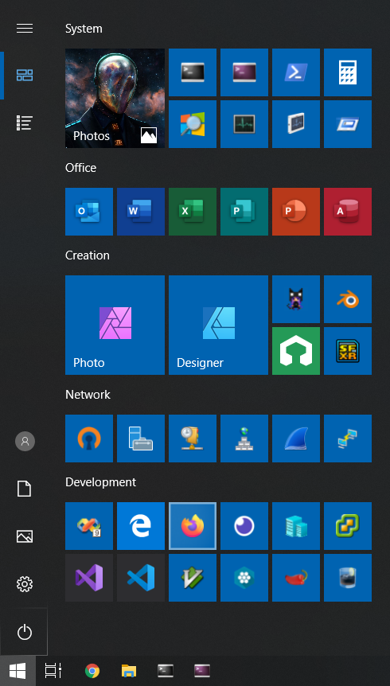

# Windows
Installation and configuration instructions for Windows 10 (Version 1809).


## Preparations
Download the latest [Windows 10](https://www.microsoft.com/en-us/software-download/windows10) image and create the installation media.

Create the file `\sources\ei.cfg` on the installation media.

```ini
[EditionID]
Professional
[Channel]
Retail
[VL]
0
```

Create the file `\sources\pid.txt` on the installation media.

```ini
[PID]
Value={windows key}
```

Copy this repo and the latest graphics drivers installer to the installation media.

## Installation
Set the BIOS date and time to the current local time.

Keep the system disconnected from the network.

Boot the installation media.

Language to install: English (United States)<br/>
Time and currency format: {Current Time Zone Country}<br/>
Keyboard or input method: {Current Hardware Keyboard}<br/>

Choose a single word username starting with a capital letter to keep the `%UserProfile%` path consistent and free from spaces.

## System
Rename the user.

```cmd
lusrmgr.msc > Users
+ Right click {User} > Rename
  Enter the same name in lower case letters.
+ Right click {User} > Properties
  Full Name: {Name Surname}
```

Change the hostname.

```
Settings > System > About > Rename PC
```

Change the NetBIOS name as **Administrator**.

```ps
$MemberDefinition = @'
[DllImport("kernel32.dll", CharSet = CharSet.Unicode)]
public static extern bool SetComputerName(string name);
'@
$Kernel32 = Add-Type -MemberDefinition $MemberDefinition -Name 'Kernel32' -Namespace 'Win32' -PassThru
$Kernel32::SetComputerName("{hostname}");
```

Disable system restore as **Administrator**.

```cmd
reg add "HKLM\SOFTWARE\Microsoft\Windows NT\CurrentVersion\SystemRestore" /v "DisableSR" /t REG_DWORD /d 1 /f
```

Disable hibernation as **Administrator** (not recommended for mobile computers).

```cmd
powercfg -h off
```

Disable virtual memory.

```
Control Panel > "System" > Advanced system settings > Advanced > Performance [Settings...] > Advanced > [Change...]
```

Reboot the system.

Install the latest graphics card drivers from the installation media.

Reboot the system.


## Cortana
Disable Cortana as **User**.

```cmd
reg add "HKCU\Software\Microsoft\Windows\CurrentVersion\Search" /v "BingSearchEnabled" /t REG_DWORD /d 0 /f
```

Disable Cortana as **Administrator**.

```cmd
reg add "HKLM\SOFTWARE\Policies\Microsoft\Windows\Windows Search" /v "AllowCortana" /t REG_DWORD /d 0 /f
reg add "HKLM\SOFTWARE\Microsoft\Windows\CurrentVersion\Search" /v "BingSearchEnabled" /t REG_DWORD /d 0 /f
reg add "HKCU\Software\Microsoft\Windows\CurrentVersion\Search" /v "BingSearchEnabled" /t REG_DWORD /d 0 /f
```


## Apps
Disable consumer apps as **Administrator**.

```cmd
reg add "HKLM\SOFTWARE\Policies\Microsoft\Windows\CloudContent" /v "DisableWindowsConsumerFeatures" /t REG_DWORD /d 1 /f
```

Uninstall unwanted apps as **Administrator**.

```ps
Get-AppxPackage -allusers 'Microsoft.GetHelp' | Remove-AppxPackage
Get-AppxPackage -allusers 'Microsoft.Getstarted' | Remove-AppxPackage
Get-AppxPackage -allusers 'Microsoft.Messaging' | Remove-AppxPackage
Get-AppxPackage -allusers 'Microsoft.Microsoft3DViewer' | Remove-AppxPackage
Get-AppxPackage -allusers 'Microsoft.MicrosoftOfficeHub' | Remove-AppxPackage
Get-AppxPackage -allusers 'Microsoft.MicrosoftSolitaireCollection' | Remove-AppxPackage
Get-AppxPackage -allusers 'Microsoft.MicrosoftStickyNotes' | Remove-AppxPackage
Get-AppxPackage -allusers 'Microsoft.MixedReality.Portal' | Remove-AppxPackage
Get-AppxPackage -allusers 'Microsoft.MSPaint' | Remove-AppxPackage
Get-AppxPackage -allusers 'Microsoft.Office.OneNote' | Remove-AppxPackage
Get-AppxPackage -allusers 'Microsoft.OneConnect' | Remove-AppxPackage
Get-AppxPackage -allusers 'Microsoft.Print3D' | Remove-AppxPackage
Get-AppxPackage -allusers 'Microsoft.SkypeApp' | Remove-AppxPackage
Get-AppxPackage -allusers 'Microsoft.WindowsCamera' | Remove-AppxPackage
Get-AppxPackage -allusers 'Microsoft.WindowsFeedbackHub' | Remove-AppxPackage
Get-AppxPackage -allusers 'Microsoft.WindowsMaps' | Remove-AppxPackage
Get-AppxPackage -allusers 'Microsoft.WindowsSoundRecorder' | Remove-AppxPackage
Get-AppxPackage -allusers 'Microsoft.Windows.Photos' | Remove-AppxPackage
Get-AppxPackage -allusers 'Microsoft.Xbox*' | Remove-AppxPackage
Get-AppxPackage -allusers 'Microsoft.YourPhone' | Remove-AppxPackage
Get-AppxPackage -allusers 'Microsoft.ZuneMusic' | Remove-AppxPackage
Get-AppxPackage -allusers 'Microsoft.ZuneVideo' | Remove-AppxPackage
```

Uninstall OneDrive.

```
Settings > Apps > Microsoft OneDrive
```

List remaining apps.

```ps
Get-AppxPackage | Select Name,PackageFullName | Sort Name
```

Uninstall unwanted optional features.

```
Settings > Apps > Manage optional features
- Microsoft Quick Assist
- Windows Hello Face
```

Clean up the Start Menu.


## Group Policies
Configure group policies (skip unwanted steps).

```
gpedit.msc > Computer Configuration > Administrative Templates > Control Panel

Personalization
+ Do not display the lock screen: Enabled

gpedit.msc > Computer Configuration > Administrative Templates > Windows Components

Cloud Content
+ Turn off Microsoft consumer experiences: Enabled

Data Collection and Preview Builds
+ Allow Telemetry: Disabled
+ Do not show feedback notifications: Enabled

OneDrive
+ Prevent OneDrive from generating network traffic until the user signs in to OneDrive: Enabled
+ Prevent the usage of OneDrive for file storage: Enabled
+ Prevent the usage of OneDrive for file storage on Windows 8.1: Enabled
+ Save documents to OneDrive by default: Disabled

Search
+ Allow Cloud Search: Disabled
+ Allow Cortana: Disabled
+ Allow Cortana above lock screen: Disabled
+ Allow search and Cortana to use location: Disabled
+ Do not allow locations on removable drives to be added to libraries: Enabled
+ Do not allow web search: Enabled
+ Don't search the web or display web results in Search: Enabled
+ Prevent automatically adding shared folders to the Windows Search index: Enabled
+ Prevent clients from querying the index remotely: Enabled

Speech
+ Allow Automatic Update of Speech Data: Disabled

Windows Defender Antivirus
+ Turn off Windows Defender Antivirus: Enabled

Windows Defender Antivirus > MAPS
+ Join Microsoft MAPS: Disabled

Windows Defender Antivirus > Network Inspection System
+ Turn on definition retirement: Disabled
+ Turn on protocol recognition: Disabled

Windows Defender Antivirus > Real-time Protection
+ Turn off real-time protection: Enabled

Windows Defender Antivirus > Signature Updates
+ Allow definition updates from Microsoft Update: Disabled
+ Check for the latest virus and spyware definitions on startup: Disabled

Windows Defender SmartScreen > Explorer
+ Configure Windows Defender SmartScreen: Disabled

Windows Defender SmartScreen > Microsoft Edge
+ Configure Windows Defender SmartScreen: Disabled

Windows Error Reporting
+ Disable Windows Error Reporting: Enabled

Windows Update
+ Configure Automatic Updates: Enabled
  Configure automatic updating: 2 - Notify for download and auto install
  ☑ Install updates for other Microsoft products
```


## Tracking
Delete diagnostics services.

```cmd
sc delete diagtrack
sc delete dmwappushservice
```

Disable Application Experience tasks.

```
Task Scheduler > Task Scheduler Library > Microsoft > Windows > Application Experience
+ Microsoft Compatibility Appraiser: Disabled
+ ProgramDataUpdater: Disabled
```


## Startup
Disable automatically started applications.

```
Task Manager > Startup
+ Windows Defender notification icon: Disabled
```


## Drivers & Updates
Disable automatic driver application installation.

```
Control Panel > "System" > Advanced system settings > Hardware > Device Installation Settings
◉ No (your device might not work as expected)
```

Reboot the system.

Connect to the Internet.

Install Windows updates.


<!--
## Services
Disable unwanted services.

```
services.msc
+ Certificate Propagation: Manual -> Disabled
+ Microsoft (R) Diagnostics Hub Standard Collector Service: Manual -> Disabled
```

Disable third party services.

```
services.msc
+ Microsoft Office Click-to-Run Service: Automatic -> Disabled
```
-->

<!--
Fix Windows Mobile Device Center (WMDC).

```cmd
taskkill /im wmdc.exe /f
taskkill /im wmdcBase.exe /f
sc stop WcesComm
sc stop RapiMgr
reg add "HKLM\SYSTEM\CurrentControlSet\Services\RapiMgr" /v "SvcHostSplitDisable" /t REG_DWORD /d 1 /f
reg add "HKLM\SYSTEM\CurrentControlSet\Services\WcesComm" /v "SvcHostSplitDisable" /t REG_DWORD /d 1 /f
reg add "HKLM\SOFTWARE\Microsoft\Windows\CurrentVersion\Run" /v "Windows Mobile Device Center" /t REG_EXPAND_SZ /d "%windir%\WindowsMobile\wmdcBase.exe" /f
reg add "HKLM\SOFTWARE\Microsoft\Windows CE Services" /v "GuestOnly" /t REG_DWORD /d 1 /f
sc config WcesComm obj= "LocalSystem" password= ""
sc config RapiMgr obj= "LocalSystem" password= ""
sc start RapiMgr
sc start WcesComm
"%windir%\WindowsMobile\wmdcBase.exe"
"%windir%\WindowsMobile\wmdc.exe"
```
-->


<!--
## Notifications
Disable unwanted notifications.

```
Control Panel > System and Security > Security and Maintenance
  [Turn off all messages about …]
```
-->


## Windows Libraries
Move unwanted Windows libraries.

1. Right click on `%UserProfile%\Pictures\Camera Roll` and select `Properties`.<br/>
   Select the `Location` tab and set it to `%AppData%\Camera Roll`.
2. Right click on `%UserProfile%\Pictures\Saved Pictures` and select `Properties`.<br/>
   Select the `Location` tab and set it to `%AppData%\Saved Pictures`.


## Explorer
<!--
```cmd
rem OneDrive
reg add "HKCR\CLSID\{018D5C66-4533-4307-9B53-224DE2ED1FE6}" /v "System.IsPinnedToNameSpaceTree" /t REG_DWORD /d 0 /f
```
-->

Hide unwanted "This PC" links as **Administrator**: 3D Objects, Desktop, Documents, Downloads, Music, Pictures, Videos

```cmd
for %i in (
  0DB7E03F-FC29-4DC6-9020-FF41B59E513A,
  B4BFCC3A-DB2C-424C-B029-7FE99A87C641,
  A8CDFF1C-4878-43be-B5FD-F8091C1C60D0, d3162b92-9365-467a-956b-92703aca08af,
  374DE290-123F-4565-9164-39C4925E467B, 088e3905-0323-4b02-9826-5d99428e115f,
  1CF1260C-4DD0-4ebb-811F-33C572699FDE, 3dfdf296-dbec-4fb4-81d1-6a3438bcf4de,
  3ADD1653-EB32-4cb0-BBD7-DFA0ABB5ACCA, 24ad3ad4-a569-4530-98e1-ab02f9417aa8,
  A0953C92-50DC-43bf-BE83-3742FED03C9C, f86fa3ab-70d2-4fc7-9c99-fcbf05467f3a
) do (
  reg delete "HKLM\SOFTWARE\Microsoft\Windows\CurrentVersion\Explorer\MyComputer\NameSpace\{%i}" /f
  reg delete "HKLM\SOFTWARE\Wow6432Node\Microsoft\Windows\CurrentVersion\Explorer\MyComputer\NameSpace\{%i}" /f
)
for %i in (
  31C0DD25-9439-4F12-BF41-7FF4EDA38722,
  B4BFCC3A-DB2C-424C-B029-7FE99A87C641,
  f42ee2d3-909f-4907-8871-4c22fc0bf756,
  7d83ee9b-2244-4e70-b1f5-5393042af1e4,
  a0c69a99-21c8-4671-8703-7934162fcf1d,
  0ddd015d-b06c-45d5-8c4c-f59713854639,
  35286a68-3c57-41a1-bbb1-0eae73d76c95
) do (
  reg add "HKLM\SOFTWARE\Microsoft\Windows\CurrentVersion\Explorer\FolderDescriptions\{%i}\PropertyBag" ^
    /v "ThisPCPolicy" /t REG_SZ /d "Hide" /f
)
```

Remove "Edit with Paint 3D" file context menus as **Administrator**.

```cmd
reg query "HKLM\SOFTWARE\Classes\SystemFileAssociations" /f "3D Edit" /s /k /e
for %i in (3mf,bmp,fbx,gif,glb,jfif,jpe,jpeg,jpg,obj,ply,png,stl,tif,tiff) do (
  reg delete "HKLM\SOFTWARE\Classes\SystemFileAssociations\.%i\Shell\3D Edit" /f
)
```

Remove "Set as desktop background" file context menus as **Administrator**.

```cmd
reg query "HKLM\SOFTWARE\Classes\SystemFileAssociations" /f "setdesktopwallpaper" /s /k /e
for %i in (bmp,dib,gif,jfif,jpe,jpeg,jpg,png,tif,tiff,wdp) do (
  reg delete "HKLM\SOFTWARE\Classes\SystemFileAssociations\.%i\Shell\setdesktopwallpaper" /f
)
```

<!--
Remove "Edit with Photos" file context menus as **Administrator**.

```cmd
reg add "HKCR\AppX43hnxtbyyps62jhe9sqpdzxn1790zetc\Shell\ShellEdit" /v "ProgrammaticAccessOnly" /t REG_SZ /d "" /f
```
-->


## Firewall
Disable all rules in Windows Firewall except the following entries.

```
wf.msc
+ Inbound Rules
  + Connect
  + Core Networking - …
  + Delivery Optimization (…)
  + Hyper-V …
  + Network Discovery (…)
+ Outbound Rules
  + Connect
  + Core Networking - …
  + Hyper-V …
  + Network Discovery (…)
```

Enable inbound rules for "Remomte Desktop - …" if necessary.

Enable inbound rules for "File and Printer Sharing (Echo Request …)". Modify "Private,Public"
rules for inbound and outbound IPv4 and IPv6 Echo Requests and select "Any IP address" under
"Remote IP address" in the "Scope" tab.


## Keymap
Use this [keymap](res/keymap.zip) to input German characters on a U.S. keyboard.

<!--
Use the [Microsoft Keyboard Layout Creator](https://www.microsoft.com/en-us/download/details.aspx?id=22339) to
create new keyboard layouts.
-->


## Microsoft Software
Configure [Microsoft Edge](https://en.wikipedia.org/wiki/Microsoft_Edge).

```
Settings > General
  Open Microsoft Edge with: A specific page or pages
    about:blank
  Open Microsoft Edge with: Previous pages
  Open new tabs with: A blank page
  Show the favorites bar: Off
  Show the home button: Off
  Show sites I frequently visit in "Top sites": Off
  Show definitions inline for: Off
  Ask me what to do with each download: Off
Settings > Privacy & security
  Show search and site suggestions as I type: Off
  Use page prediction: Off
Settings > Passwords & autofill
  Save form data: Off
```

Configure [Internet Explorer](https://en.wikipedia.org/wiki/Internet_Explorer).

```
Internet options > General
Home page: about:blank
Startup: Start with tabs from the last session
```

<!--
Configure the Photos app.

```
Photos > Settings
Linked duplicates: Off
People: Off
Mouse wheel: Zoom in and out
Mode: Dark
Show a notification when new albums are available: Off
```

Configure [Outlook 2016](https://products.office.com/en/outlook).

```cmd
reg add "HKCU\SOFTWARE\Microsoft\Office\16.0\Outlook\Setup" /v "DisableOffice365SimplifiedAccountCreation" /t REG_DWORD /d 1 /f
```
-->


## Fonts
Install useful fonts.

* [DejaVu](https://sourceforge.net/projects/dejavu/files/dejavu)
* [Iconsolata](http://www.levien.com/type/myfonts/inconsolata.html)
* [IPA](http://ipafont.ipa.go.jp)


## Third Party
Install third party software.

* [7-Zip](http://www.7-zip.org)
* [Chrome](https://www.google.com/chrome/)
* [ConEmu](https://conemu.github.io)
* [Affinity Photo](https://affinity.serif.com/photo)
* [Affinity Designer](https://affinity.serif.com/designer)
* [Sketchbook Pro](http://www.autodesk.com/products/sketchbook-pro/overview)
* [Blender](https://www.blender.org/)
* [gVim](http://www.vim.org)
* [HxD](https://mh-nexus.de/en/downloads.php?product=HxD20)

Install [Git](https://git-scm.com/downloads) with specific settings.

```
Select Destination Location
  C:\Program Files\Git
Select Components
  ☐ Windows Explorer integration
  ☑ Git LFS (Large File Support)
  ☐ Associate .git* configuration files with the default text editor
  ☐ Associate .sh files to be run with Bash
Select Start Menu Folder
  ☑ Don't create a Start Menu folder
Choosing the default editor used by Git
  [Select other editor as Git's default editor]
  Location of editor: C:\Program Files (x86)\Vim\vim81\gvim.exe
  [Test Custom Editor]
Adjusting your PATH environment
  ◉ Use Git from Git Bash only
Choosing the SSH executable
  ◉ Use OpenSSH
Choosing HTTPS transport backend
  ◉ Use the OpenSSL library
Configuring the line ending conversions
  ◉ Checkout as-is, commit as-is
Configuring the terminal emulator to use with Git Bash
  ◉ Use Windows' default console window
Configuring file system caching
  ☑ Enable file system caching
  ☑ Enable Git Credential Manager
  ☑ Enable symbolic links
```

Add `%ProgramFiles%\Git\cmd` to `Path`.

## gVim
Configure gVim.

```cmd
git clone https://github.com/qis/vim %UserProfile%\vimfiles
```


<!--
## Server
Install software for Windows Server administration.


* [SQL Server Management Studio](https://msdn.microsoft.com/en-us/library/mt238290.aspx)
* [Remote Server Administration Tools for Windows 10](https://www.microsoft.com/en-us/download/details.aspx?id=45520)

Configure the WinRM client.

```cmd
Get-NetConnectionProfile
Set-NetConnectionProfile -InterfaceIndex {InterfaceIndex} -NetworkCategory Private
Set-Item WSMan:\localhost\Client\TrustedHosts -Value "*" -Force
```

Configure the WinRM server.

```ps
Enable-PSRemoting -SkipNetworkProfileCheck -Force
Set-NetFirewallRule -Name "WINRM-HTTP-In-TCP-PUBLIC" -RemoteAddress Any
Set-Item WSMan:\localhost\Client\TrustedHosts -Value "*" -Force
```

Configure the WinRM server to accept HTTPS connections.

```ps
winrm enumerate winrm/config/listener
New-SelfSignedCertificate -DnsName "{DomainName}" -CertStoreLocation Cert:\LocalMachine\My
cmd /C 'winrm create winrm/config/Listener?Address=*+Transport=HTTPS @{Hostname="{DomainName}"; CertificateThumbprint="{Thumbprint}"}'
netsh advfirewall firewall add rule name="Windows Remote Management (HTTPS-In)" dir=in action=allow protocol=TCP localport=5986
```

Connect over HTTP.

```ps
Enter-PSSession -ComputerName host.domain -Port 5985 -Credential administrator@domain
```

Connect over HTTPS.

```ps
$soptions = New-PSSessionOption -SkipCACheck
Enter-PSSession -ComputerName host.domain -Port 5986 -Credential administrator@domain -SessionOption $soptions -UseSSL
```
-->


<!--
## Control Panel
Add Control Panel shortcuts to the Windows start menu (use icons from `C:\Windows\System32\shell32.dll`).

[Control Panel Command Line Commands](https://www.lifewire.com/command-line-commands-for-control-panel-applets-2626060)
-->


<!--
## Anti-Virus
Suggested third party anti-virus exclusion lists.

```
Excluded Processes

%ProgramFiles(x86)%\Microsoft Visual Studio\2017\Professional\Common7\IDE\devenv.exe
%ProgramFiles(x86)%\Microsoft Visual Studio\2017\Professional\Common7\IDE\PerfWatson2.exe
%ProgramFiles(x86)%\Microsoft Visual Studio\2017\Professional\Common7\IDE\VcxprojReader.exe
%ProgramFiles(x86)%\Microsoft Visual Studio\2017\Professional\VC\Tools\MSVC\14.12.25827\bin\HostX86\x64\CL.exe
%ProgramFiles(x86)%\Microsoft Visual Studio\2017\Professional\VC\Tools\MSVC\14.12.25827\bin\HostX86\x64\link.exe

Excluded Directories

%ProgramFiles(x86)%\Microsoft Visual Studio\
%ProgramFiles(x86)%\Windows Kits\
%UserProfile%\AppData\Local\lxss\
C:\Workspace\
```
-->


## Windows Features
Enable or disable Windows features.

```
Control Panel > Programs > Turn Windows features on or off
▣ .NET Framework 3.5 (includes .NET 2.0 and 3.0)
☐ Microsoft XPS Document Writer
☐ Print and Document Services
▣ SMB 1.0/CIFS File Sharing Support
  ☑ SMB 1.0/CIFS Client
☑ Telnet Client
☑ TFTP Client
☑ Windows Subsystem for Linux
☐ Work Folders Client
```

Reboot the system.

## Windows Subsystem for Linux
Install a WSL distro from <https://aka.ms/wslstore>, launch it and download config files.

```sh
rm -f .bashrc .bash_history .bash_logout .profile .tmux.conf
wget https://raw.githubusercontent.com/qis/windows/master/wsl/.bashrc
wget https://raw.githubusercontent.com/qis/windows/master/wsl/.profile
wget https://raw.githubusercontent.com/qis/windows/master/wsl/.tmux.conf
touch .viminfo
```

Configure [sudo(8)](http://manpages.ubuntu.com/manpages/xenial/man8/sudo.8.html) with `sudo EDITOR=vim visudo`.

```sh
# Locale settings.
Defaults env_keep += "LANG LANGUAGE LINGUAS LC_* _XKB_CHARSET"

# Profile settings.
Defaults env_keep += "MM_CHARSET EDITOR PAGER CLICOLOR LSCOLORS TMUX SESSION"

# User privilege specification.
root  ALL=(ALL) ALL
%sudo ALL=(ALL) NOPASSWD: ALL

# See sudoers(5) for more information on "#include" directives:
#includedir /etc/sudoers.d
```

Create `/etc/wsl.conf`.

```sh
[automount]
enabled=true
options=case=off,metadata,uid=1000,gid=1000,umask=022
```

Fix timezone information.

```sh
sudo rm /etc/localtime
sudo ln -s /usr/share/zoneinfo/Europe/Berlin /etc/localtime
echo Europe/Berlin | sudo tee /etc/timezone
```

Add the following line to `/etc/mdadm/mdadm.conf` (fixes some `apt` warnings).

```sh
# definitions of existing MD arrays
ARRAY <ignore> devices=/dev/sda
```

Modify the following lines in `/etc/pam.d/login` (disables message of the day).

```sh
#session    optional    pam_motd.so motd=/run/motd.dynamic
#session    optional    pam_motd.so noupdate
```

Restart `bash.exe`.

Create Windows symlinks.

```sh
mkdir -p ~/.config
ln -s /mnt/c/Users/Qis/.gitconfig ~/.gitconfig
ln -s /mnt/c/Users/Qis/vimfiles ~/.config/nvim
ln -s /mnt/c/Users/Qis/vimfiles ~/.vim
ln -s /mnt/c/Users/Qis/Documents ~/documents
ln -s /mnt/c/Users/Qis/Downloads ~/downloads
ln -s /mnt/c/Workspace ~/workspace
mkdir -p ~/.ssh
for i in config id_rsa id_rsa.pub known_hosts; do
  ln -s /mnt/c/Users/Qis/.ssh/$i ~/.ssh/$i
done
chmod 0600 ~/.ssh/*
sudo mkdir -p /root/.config
sudo ln -s /mnt/c/Users/Qis/vimfiles /root/.config/nvim
sudo ln -s /mnt/c/Users/Qis/vimfiles /root/.vim
```

Install packages.

```sh
sudo apt update
sudo apt upgrade
sudo apt dist-upgrade
sudo apt autoremove
sudo apt install apt-file p7zip p7zip-rar zip unzip tree htop python-minimal
sudo apt install imagemagick pngcrush webp
sudo apt install siege
sudo apt-file update
```

Install youtube-dl.

```sh
sudo curl -L https://yt-dl.org/downloads/latest/youtube-dl -o /usr/local/bin/youtube-dl
sudo chmod a+rx /usr/local/bin/youtube-dl
```

Install [WSLtty](https://github.com/mintty/wsltty) for better terminal support.

<!--
Install [VcXsrv](https://github.com/ArcticaProject/vcxsrv/releases) for Xorg application support.
-->


## Settings
Follow the [Settings](settings.md) guide to finish the configuration.


## Development
Follow the [Development](development.md) guide to set up a developer workstation.


## Start Menu

