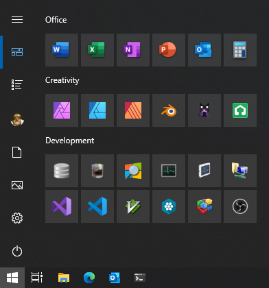

# Windows
Installation and configuration instructions for Windows 10 20H2.

<!--
Fix drive previously used for unix partitions with `diskpart`.

```cmd
DISKPART> list disk
DISKPART> select disk 1
DISKPART> clean
DISKPART> create partition primary
DISKPART> active
DISKPART> format fs=Fat32 quick
```
-->

## Preparations
Download the latest [Windows 10](https://www.microsoft.com/en-us/software-download/windows10) image
and create the installation media using the Media Creation Tool or [Rufus](https://rufus.ie/).

Create the file `\sources\ei.cfg` on the installation media.

```ini
[EditionID]
Professional
[Channel]
OEM
[VL]
0
```

Create the file `\sources\pid.txt` on the installation media if `Channel` is `Retail`.

```ini
[PID]
Value={windows key}
```

Copy this repo and the latest graphics drivers installer to the installation media.

Set the BIOS date and time to the current local time.

**Keep the system disconnected from the network.**

## Installation
Boot the installation media.

```
Language to install: English (United States)
Time and currency format: {Current Time Zone Country}
Keyboard or input method: {Current Hardware Keyboard}
```

Choose a single word username starting with a capital letter to keep the `%UserProfile%` path
consistent and free from spaces.

Verify Windows flavor and version with `Start > "winver"`.

## Setup
Modify and execute [setup/system.ps1](setup/system.ps1) using the "Run with PowerShell" context menu
repeatedly until it stops rebooting the system.

## Drivers & Updates
Disable automatic driver application installation.

```
Start > "Change device installation settings"
◉ No (your device might not work as expected)
```

1. Reboot the system.
2. Connect to the Internet.
3. Install Windows updates.
4. Repeat the "Setup" step.

Reboot the system.

<!--
## VLAN Support
<https://downloadcenter.intel.com/download/25016/Intel-Network-Adapter-Driver-for-Windows-10>
-->

## Settings
Settings that have yet to be incorporated into the [setup/system.ps1](setup/system.ps1) script.

### Keymap (Optional)
1. Install [res/keymap.zip](res/keymap.zip) to input German characters on a U.S. keyboard.
2. Configure Windows language preferences in Settings.
3. Reboot the system.

<!--
Use the [Microsoft Keyboard Layout Creator](https://www.microsoft.com/en-us/download/details.aspx?id=22339) to
create new keyboard layouts.
-->

### Devices
```
Typing
+ Spelling
  ☐ Autocorrect misspelled words
+ Typing
  ☐ Add a period after I double-tap the Spacebar

AutoPlay
+ Choose AutoPlay defaults
  Removable drive: Open folder to view files (File Explorer)
  Memory card: Open folder to view files (File Explorer)
```

### Network & Internet
```
Proxy
+ Automatic proxy setup
  ☐ Automatically detect settings
```

### Personalization
```
Background
+ Background
  Browse: (select picture)

Colors
+ Choose your color
  Windows colors: Navy blue

Lock screen
+ Preview
  Browse: (select picture)

Start
+ Start
  ☐ Show app list in Start menu
```

### Time & Language
```
Region
+ Region
  Country or region: United States
  Regional format: English (United States)
+ Additional date, time, & regional settings > Change date, time, or number formats
  Formats > Additional settings...
  + Numbers
    Digit grouping symbol: ␣
    Measurement system: Metric
  + Currency
    Currency symbol: €
    Positive currency format: 1.1 €
    Negative currency format: -1.1 €
    Digit grouping symbol: ␣
  + Time
    Short time: HH:mm
    Long time: HH:mm:ss
  + Date
    Short date: yyyy-MM-dd
    Long date: ddd, d MMMM yyyy
    First day of week: Monday
  Administrative
  + Copy settings...
    ☑ Welcome screen and system accounts
    ☑ New user accounts
```

Reboot the system.

### Privacy
```
General
+ Change privacy options
  ☐ Let Windows track app launches to improve Start and search results
```

### Shortcuts
Create Network Connections shortcut in `powershell.exe`.

```ps
$sm = "${env:UserProfile}\AppData\Roaming\Microsoft\Windows\Start Menu\Programs\Network Connections.lnk"
$ws = New-Object -ComObject WScript.Shell
$sc = $ws.CreateShortcut($sm)
$sc.IconLocation = 'C:\Windows\System32\netshell.dll,0'
$sc.TargetPath = 'C:\Windows\System32\control.exe'
$sc.Arguments = 'ncpa.cpl'
$sc.Save()
Invoke-Item $sm
```

## Windows Libraries
Move unwanted Windows libraries.

1. Right click on `%UserProfile%\Pictures\Camera Roll` and select `Properties`.<br/>
   Select the `Location` tab and change the path to `%AppData%\Pictures\Camera Roll`.
2. Right click on `%UserProfile%\Pictures\Saved Pictures` and select `Properties`.<br/>
   Select the `Location` tab and change the path to `%AppData%\Pictures\Saved Pictures`.
3. Right click on `%UserProfile%\Videos\Captures` and select `Properties`.<br/>
   Select the `Location` tab and change the path to `%AppData%\Videos\Captures`.

<!--
Permanently hide `Captures` directory.

```cmd
md "%UserProfile%\Videos\Captures"
attrib +s +h "%UserProfile%\Videos\Captures"
```
-->

## Indexing Options
Configure Indexing Options to only track the "Start Menu" and rebuild the index.

## Firewall
Disable all rules in Windows Firewall except the following entries.

```
wf.msc
+ Inbound Rules
  Core Networking - …
  Delivery Optimization (…)
  Hyper-V …
  Network Discovery (…)
+ Outbound Rules
  Core Networking - …
  Hyper-V …
  Network Discovery (…)
```

Enable inbound rules for `Core Networking Diagnostics - ICMP Echo Request (ICMPv…-In)`.<br/>
Modify `Private,Public` rules for `ICMPv4` and `ICMPv6` inbound rules and select `Any IP address`
under `Remote IP address` in the `Scope` tab.

## Microsoft Software
* Install [Microsoft Edge](https://www.microsoft.com/en-us/edge) and configure
  [settings](https://gist.github.com/qis/8d5c6fb9d622540d88bfcc6934a20e3e).
* Install [Microsoft Office](https://account.microsoft.com/services/) and configure
  [settings](https://gist.github.com/qis/2a0d23ed27b21cd15331b4ff3a1cf430).
* Install [Windows Terminal](https://aka.ms/terminal) and configure
  [settings](https://github.com/qis/terminal).

Configure autostart options.

```
Start > "Task Manager" > Startup
Send to OneNote Tool: Disabled
Windows Terminal: Enabled
```

## Applications
Install third party software.

* [7-Zip](http://www.7-zip.org)
* [Affinity Photo](https://affinity.serif.com/photo)
* [Affinity Designer](https://affinity.serif.com/designer)
* [Affinity Publisher](https://affinity.serif.com/publisher)
* [Audacity](https://www.audacityteam.org/)
* [Blender](https://www.blender.org/)
* [Explorer Suite](http://www.ntcore.com/exsuite.php)
* [ImageGlass](https://imageglass.org/)
* [LMMS](https://lmms.io/)
* [MagicaVoxel](https://ephtracy.github.io/)
* [OBS Studio](https://obsproject.com/download)

Install or restore portable 64-bit third party software.

* [MPV](https://mpv.srsfckn.biz/)
* [HxD](https://mh-nexus.de/en/downloads.php?product=HxD20)
* [Dependencies](https://github.com/lucasg/Dependencies)
* [SQLite Browser](https://sqlitebrowser.org/)
* [Sumatra](https://www.sumatrapdfreader.org/free-pdf-reader.html)

Install or restore portable 32-bit third party software.

* [KeePass](https://keepass.info/)
* [SFXR](http://www.drpetter.se/project_sfxr.html)
* [Resource Hacker](http://www.angusj.com/resourcehacker/)
* [Sysinternals Suite](https://technet.microsoft.com/en-us/sysinternals/bb842062.aspx)
* [Vim](https://www.vim.org/download.php)

<!--
* [FontForge](https://fontforge.github.io/en-US/downloads/windows-dl/)
* [Gimp](https://www.gimp.org/)
* [NAPS2](https://www.naps2.com/)
-->

Disable Affinity update checks.

```cmd
reg add "HKLM\SOFTWARE\Serif\Affinity\Photo\1" /v "No Update Check" /t REG_DWORD /d 1 /f
reg add "HKLM\SOFTWARE\Serif\Affinity\Designer\1" /v "No Update Check" /t REG_DWORD /d 1 /f
reg add "HKLM\SOFTWARE\Serif\Affinity\Publisher\1" /v "No Update Check" /t REG_DWORD /d 1 /f
```

Configure LMMS paths on first startup.

- Replace `%UserProfile%\Documents` with `%UserProfile%\Music`.
- Use `PortAudio` with `WASAPI` backend.

## Windows Subsystem for Linux
See [wsl/ubuntu.md](wsl/ubuntu.md) for WSL setup instructions.

## Development
See [development.md](development.md) for development setup instructions.

## Start Menu


<!--
explorer "%AppData%\Microsoft\Windows\Start Menu\Programs"
explorer "C:\ProgramData\Microsoft\Windows\Start Menu\Programs"
-->
