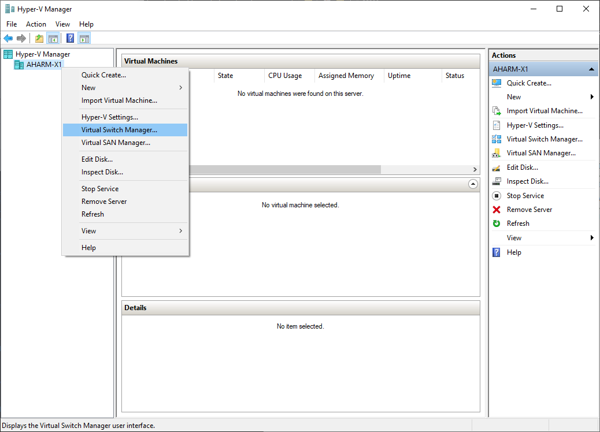
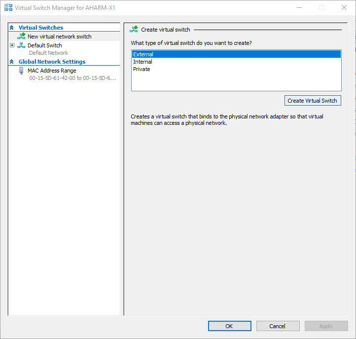
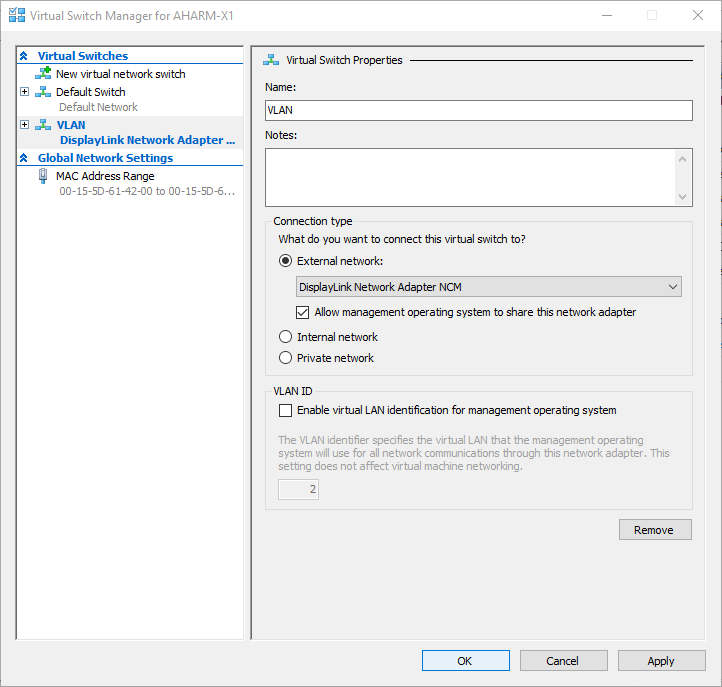

# VLAN
Configure VLANs on Windows 10.

## Hyper-V Manager
Create a virtual switch using the Hyper-V Manager (`virtmgmt.msc`).





# PowerShell
Manage virtual adapters as Administrator in `powershell.exe`.

1. Create virtual adapters on the virtual switch.

```ps
Add-VMNetworkAdapter -ManagementOS -SwitchName "VLAN" -Name "VLAN 10"
Add-VMNetworkAdapter -ManagementOS -SwitchName "VLAN" -Name "VLAN 400"
```

2. Assign VLAN IDs to virtual adapters.

```ps
Set-VMNetworkAdapterVlan -ManagementOS -VMNetworkAdapterName "VLAN 10"  -Access -VlanId 10
Set-VMNetworkAdapterVlan -ManagementOS -VMNetworkAdapterName "VLAN 400" -Access -VlanId 400
```

3. Remove virtual adapters when no longer needed.

```ps
Remove-VMNetworkAdapter -ManagementOS -SwitchName "VLAN" -Name "VLAN 10"
Remove-VMNetworkAdapter -ManagementOS -SwitchName "VLAN" -Name "VLAN 400"
```
